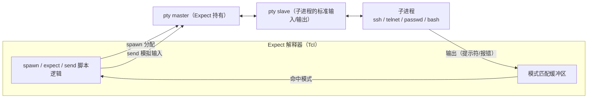
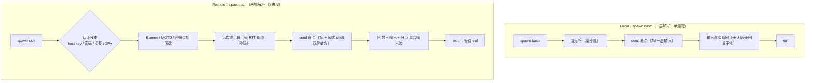
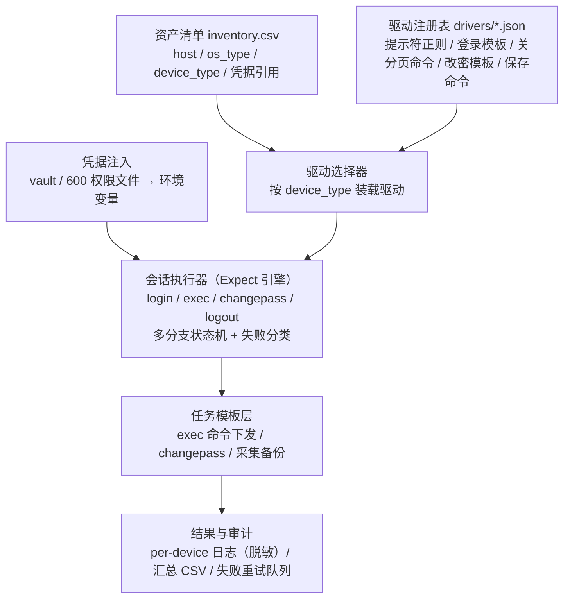
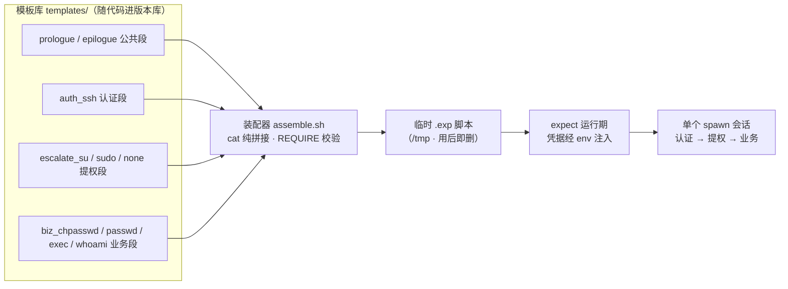
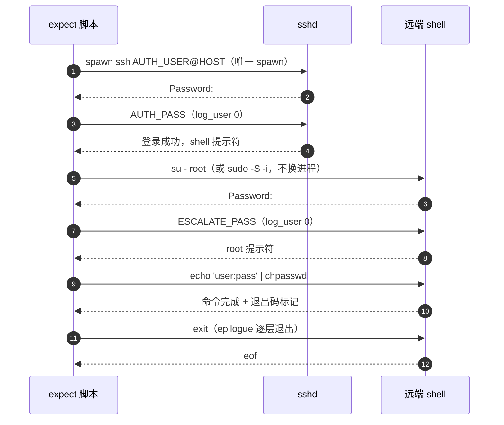

# 基于 Expect 的远程设备管理调研报告

> 深度技术调研报告

> Expect remote shell 与 local shell 差异、主机操作系统与主流网络设备品牌兼容性、批量改密方案与工程陷阱的系统性调研

> **调研范围**：Expect 技术体系 · Linux/Unix/国产操作系统 · 网络设备 7 大品牌

> **报告类型**：技术选型与实施方案调研

> **完成日期**：2026-09-01

> **信息时效**：引用来源含 2026 年最新官方文档

## 目录

- 执行摘要

- Expect 技术原理与能力边界

- Local Shell 与 Remote Shell 的核心差异

- 主机操作系统差异矩阵

- 网络设备品牌差异矩阵

- 改密场景深度分析

- 工程陷阱与最佳实践

- 多平台 Expect 适配框架设计

- 替代方案与工具选型

- 结论与实施建议

- 实施方案：模板拼装框架

- 附录 A · 改密命令速查表

## 执行摘要

本报告围绕"以 Expect 实现 remote shell 级远程设备管理（含但不限于批量改密）"这一需求展开，覆盖 Expect 技术原理、本地与远程 shell 差异、主机操作系统差异、网络设备品牌差异、改密方案路线、工程陷阱与替代工具选型，共引用 62 个来源并做了交叉验证。

核心结论如下：

1. \*\*Expect 是经过三十余年验证的跨平台交互自动化底座。\*\*它由 NIST 的 Don Libes 于 1990 年发布，设计目标正是自动化 `telnet`、`ssh`、`passwd`、`fsck`、`rlogin` 这类必须人机对话的程序，通过伪终端（pty）与子进程对话，不要求远端安装任何 Agent\[1]\[2]\[5]。这一"零侵入"特性使它至今仍是异构老旧设备（Telnet 设备、AIX 小型机、各品牌交换机）管理的现实选择。

2. \*\*Local 与 Remote 的本质差异是"一层解析变双层、一个进程变两个进程"。\*\*remote 模式引入认证分支、Banner、网络时延、远端 pty 回显与双重引号解析，模式匹配与转义复杂度显著上升；脚本必须显式覆盖 `timeout`、`eof`、连接拒绝、密码过期等异常分支，否则极易挂死\[3]\[7]\[10]。

3. \*\*主机侧批量改密存在三条路线：管道式（`chpasswd`）、交互驱动式（Expect 驱动 `passwd`）、认证辅助式（`sshpass`/SSH 密钥）。\*\*其中 `passwd --stdin` 存在发行版分裂：RHEL 系由下游补丁提供，Debian/Ubuntu 旧版本不支持，而新版上游 shadow-utils 4.17+ 已合入 `-s/--stdin`；跨平台脚本应以 `chpasswd` 为首选、Expect 交互驱动为兜底\[16]\[17]\[18]\[19]。

4. \*\*主机操作系统差异集中在四个维度：root/sudo 策略、非交互改密命令、密码策略（PAM）、提示符语言。\*\*Ubuntu 默认锁定 root 必须经 `sudo`；AIX 提供 root 专用的 `chpasswd` 且本地密码仅前 8 字符有效；中文 locale 下 `passwd` 提示变为"新的密码："，是匹配失败的高频原因\[13]\[14]\[21]\[44]。

5. \*\*网络设备差异集中在五个维度：登录协议、视图层级与提示符、改密命令形态（单行式/交互式）、配置保存机制、分页行为。\*\*Cisco/华为/H3C/瞻博/锐捷/Fortinet 的改密命令均有官方文档可依；中兴 ZXR10 为类 Cisco 命令风格（社区资料）。改密后"保存配置"与"关闭分页"是两类最容易被忽略的必经步骤\[27]\[29]\[34]\[43]。

6. \*\*Expect 方案的最大风险是安全与可维护性。\*\*密码可能经命令行参数暴露于 `ps`/`/proc`、被 `log_file` 写入会话日志；平台差异靠"驱动模板"兼容，模板数量随设备型号增长，必须以框架化管理加以约束\[46]\[47]\[48]。

7. \*\*选型建议：高度异构存量（Telnet、老旧 Unix、多品牌网络设备）以 Expect/Pexpect 框架为现实选择；网络设备为主的场景可演进到 Netmiko（支持 80+ 设备类型）；主机完成标准化后可演进到 Ansible，AIX 场景有 IBM 官方 `power_aix` 集合。\*\*三者并非互斥，推荐的终态是"Expect 驱动库 + Python 编排"的混合架构\[53]\[55]\[56]\[57]。

## Expect 技术原理与能力边界

### 2.1 起源与定位

Expect 由美国国家标准与技术研究院（NIST）计算机科学家 Don Libes 于 1990 年发布，其 1991 年的 USENIX 论文系统阐述了"用脚本控制交互式进程"的模型\[1]\[2]。它的设计目标明确指向 `telnet`、`ftp`、`passwd`、`fsck`、`rlogin`、`tip` 等当时无法脚本化的人机对话程序\[1]——这恰好覆盖了本需求中"远程登录各类设备"与"修改密码"两个核心场景。

语言层面，Expect 是 Tcl 的扩展，提供分支与嵌套结构来引导程序流程，并可在任意时刻把控制权交还用户、之后再收回（`interact` 机制）\[5]。除独立解释器形态外，Expect 还能以 `libexpect` 库形式嵌入 C/C++ 程序，实现不依赖 Tcl 解释器的定制化集成\[4]\[5]。

### 2.2 运行模型：spawn + pty + 模式匹配

Expect 自动化的核心机制是**伪终端（pseudo-terminal，pty）**：`spawn` 在 Expect 管理下启动子进程，并自动为其分配一个 pty；pty 的 slave 端对子进程而言与真实终端完全一致（因而 `passwd`、`login` 等要求终端的程序不会拒绝执行），master 端由 Expect 持有并读写\[4]。这也是 Expect 能"骗过"所有交互式程序的根本原因。

`expect` 命令持续监视子进程输出并维护匹配缓冲区：每当新输出到达，就按**模式在列表中出现的顺序**逐个比较；多个模式同时命中时取列表中靠前者执行对应动作体；`timeout` 与 `eof` 作为异常条件参与同一分支结构\[3]\[1]。`send` 则向 pty master 写入数据，模拟人工键入。



### 2.3 核心命令速查

| 命令                    | 作用                   | 关键语义与注意事项                                                       |

| --------------------- | -------------------- | --------------------------------------------------------------- |

| `spawn`               | 启动子进程并接管其 pty        | 被跟踪进程可以是本地 `bash`，也可以是 `ssh`/`telnet` 等本身再发起远程连接的进程\[3]\[4]     |

| `expect`              | 多模式匹配子进程输出           | 按列表顺序匹配；支持正则与 glob；`timeout`/`eof` 作为分支参与；无任何模式命中则等待至超时\[3]     |

| `send`                | 向子进程写入输入             | 回车必须显式写作 `\r`；过快发送长文本可用慢速模式参数防丢字符\[3]                           |

| `exp_continue`        | 命中后继续在同一个 expect 内循环 | 适合密码提示反复出现、SSH 首次登录 `yes/no` 等场景；进程已结束时外层不要再接 `expect eof`\[12] |

| `interact`            | 把控制权交还给人工            | 半自动场景（登录后人工接管）使用\[5]                                            |

| `set timeout`         | 设置全局/局部超时            | 默认 10 秒；跨网设备建议放大并显式处理超时分支\[3]\[48]                              |

| `log_file`/`log_user` | 会话落盘 / 屏幕回显开关        | 改密场景必须关闭或事后脱敏，防止密码进入日志\[48]                                     |

| `expect eof`          | 等待子进程结束              | 批量脚本的规范收尾，用于回收进程并判定远端命令真正结束\[62]                                |

| `lindex $argv N`      | 读取命令行参数              | 密码经参数传入会暴露于进程列表，需改用环境变量\[9]                                     |

### 2.4 autoexpect：从录制起步

`autoexpect` 监视一次人工交互会话，生成可复现该会话的 Expect 脚本，默认输出为 `script.exp`，还提供只匹配提示符的精简模式（`-p`），使生成的脚本对输出变化不那么敏感\[6]。需要注意的是，autoexpect 产出的脚本可读性差、难以维护，官方及社区一致建议把它当作**模板起点**而非最终交付物\[2]。在第八章的框架设计中，录制脚本被定位为"新设备驱动入库前的取样工具"。

### 2.5 四种运行形态与转义层级

Expect 在工程中有四种常见形态，复杂度依次递增：独立脚本（`#!/usr/bin/expect`）、`expect -c` 单行命令、嵌入 shell 脚本的 heredoc 块、libexpect C 嵌入\[4]\[8]。形态选择直接决定**引号与变量要经过几层解释器**——这是第三章 local/remote 差异与第七章陷阱清单反复出现的主线。

> **能力边界**

>

> Expect 解决的是"会话层"的自动化：它能把任何字符流驱动的 CLI 变成可编程接口，但不提供结构化数据、配置 diff、并发调度与状态管理——这些能力要靠上层的框架设计（第八章）或 Python/Ansible 生态（第九章）补齐\[55]\[58]。

## Local Shell 与 Remote Shell 的核心差异

"expect local shell"指 `spawn` 直接启动本地 shell 执行命令；"expect remote shell"指 `spawn ssh/telnet` 登录远端后再在远端 shell 中执行命令。两者共用同一套 expect/send 语法，但会话拓扑完全不同，脚本必须按远程拓扑重新设计。

### 3.1 会话建立：从"零认证"到"认证状态机"

本地模式中，`spawn bash` 之后毫秒级出现提示符，中间没有任何不确定性。远程模式中，从 `spawn ssh user@host` 到拿到远端提示符之间是一个**认证状态机**：首次连接可能出现 host key 确认（`yes/no`）；随后是密码提示或公钥认证；认证失败会出现 `Permission denied`；网络不可达会出现 `Connection refused`、`No route to host`；账号密码已过期则直接被拉入强制改密流程\[10]\[11]。健壮的脚本必须用多分支 `expect {}` 把这些路径全部覆盖，并对不可达、认证失败等给出明确的失败分类，而不是让脚本在 `timeout` 后挂死。

```text

# 远程登录分支模板（节选）

expect {

    "(yes/no"       { send "yes\r"; exp_continue }

    "password:"      { send "$passwd\r" }

    "Permission denied" { puts "AUTH_FAIL"; exit 2 }

    "Connection refused" { puts "UNREACHABLE"; exit 3 }

    "Current password" { # 密码过期，转入强制改密子流程 }

    timeout           { puts "TIMEOUT"; exit 4 }

    eof               { puts "SESSION_EOF"; exit 5 }

}

```

### 3.2 命令传递：从一层解析到双层解析

本地模式中，`send` 出去的字符串只经过**Tcl 一层**解析（Tcl 的引号、`$`、`[]`、反斜杠转义）。远程模式中，这条字符串还要原样落到**远端 shell**（bash/ksh/sh/csh，随 OS 而异）再做一次解释：双引号、单引号、`$`、反斜杠在两层解释器中语义叠加，出现"转义的转义"。

社区实践反复验证了两类高发问题：其一，`spawn` 命令本身带多对引号时会触发难以定位的 Tcl 语法错误（如 `extra characters after close-quote`），带引号的命令建议改用变量拼接而非字面量\[7]；其二，在 shell 脚本中用双引号包裹 `expect -c` 或 heredoc 嵌入 Expect 时，变量会被 shell 提前展开，导致 Expect 内引用为空，正确做法是 shell 层 `export` 环境变量、Expect 层用 `$env(VAR)` 读取，或对拼接内容使用 `printf '%q'` 自动转义\[8]\[9]。

```text

# shell 嵌套 expect：变量经环境变量传递（推荐）

export OPS_USER=root OPS_PASS='xxx' NEW_PASS='yyy'

/usr/bin/expect <<'EOF'

set user $env(OPS_USER)      # 不会被 shell 提前展开

set pass $env(OPS_PASS)

spawn ssh $user@$host

expect "password:"

send "$pass\r"

expect "# "

send "echo user:pass | chpasswd\r"

EOF

```

### 3.3 回显：远端 pty 会把命令"念"回来

本地与远程的另一个关键差异来自**终端回显**。当以交互方式登录（`spawn ssh user@host` 不带命令参数，或 `ssh -t`）时，远端 sshd 会为会话分配 pty，远端终端驱动默认开启 ECHO——Expect 发送的每条命令都会以回显形式出现在匹配缓冲区里，与命令输出混在一起。模式匹配因此必须**锚定提示符行尾**而非命令文本，否则极易把"自己刚发出的命令"误判为设备输出。反之以 `ssh host command` 一次性执行时没有 pty、没有回显、也没有提示符，只能靠 `expect eof` 与退出码判定结束\[3]\[4]。

> **高频事故**

>

> 把"命令回显"当成"命令输出"判定成功：例如脚本 send `write memory` 后立即匹配 `write` 字样——命中的其实是远端回显，配置未必真正保存。规避方式：匹配提示符（且提示符出现在行首），或以固定结束标记（`echo DONE_$RANDOM`）判定命令真正返回。

### 3.4 时序、超时与生命周期

- \*\*时序：\*\*本地交互毫秒级完成；远程受网络 RTT 与对端负载影响，慢速链路上的设备登录可能需要数十秒，`timeout` 应按平台分级设置（主机 20-30 秒、网络设备 30-60 秒），并为每个 `expect` 显式写 `timeout` 分支\[3]\[48]。

- \*\*生命周期：\*\*本地子进程退出即 `eof`；远程还要处理"连接中断导致的提前 eof"与"命令完成但会话未退出"两种错位，规范做法是显式 `send "exit\r"` 后再 `expect eof`；使用 `exp_continue` 时进程结束后不要再叠加 `expect eof`，否则会因重复收到 eof 报错\[12]。

- \*\*命令语义：\*\*同一条命令在 bash/ksh/sh/csh 下转义与内建行为不同；AIX 默认 ksh、Ubuntu 默认 bash、部分网络设备底层为 VxWorks/Linux 私有 CLI，均需按目标 shell 生成命令字符串。

### 3.5 差异总览



| 维度   | expect local shell | expect remote shell                | 对脚本设计的影响                                |

| ---- | ------------------ | ---------------------------------- | --------------------------------------- |

| 进程拓扑 | Expect → 本地子进程     | Expect → ssh/telnet → 远端 shell（两跳） | 远端退出≠命令完成，需 `expect eof` 收尾\[12]        |

| 认证环节 | 无                  | host key / 密码 / 公钥 / 过期强改          | 登录必须写成多分支状态机\[10]\[11]                  |

| 引号解析 | Tcl 一层             | Tcl + 远端 shell 两层                  | 多对引号易触发 Tcl 语法错误，改用变量拼接\[7]             |

| 变量注入 | `$argv` 即可         | shell/expect 双层作用域                 | 经 `export` + `$env()` 传递，避免提前展开\[8]\[9] |

| 输出构成 | 纯命令输出              | Banner + 回显 + 输出 + 分页              | 匹配锚定提示符行尾；先关分页                          |

| 时延量级 | 毫秒                 | 数百毫秒至数十秒                           | timeout 分级放大，显式超时分支\[48]                |

| 失败面  | 命令非零退出             | 网络/认证/权限/命令四类叠加                    | 失败分类编码，供批量框架统计重试                        |

| 会话清理 | 子进程退出即结束           | 需 exit + eof 双确认                   | 防僵尸 ssh 进程占用控制端资源                       |

## 主机操作系统差异矩阵

主机侧管理面对的是"同一套 passwd/chpasswd 命令在不同 Unix/Linux 变体上的语义分裂"。本章按发行版逐项核对官方文档，给出可直接落地的命令矩阵与陷阱清单。

### 4.1 非交互改密命令矩阵

| 操作系统                                        | 非交互改密首选                                             | `passwd --stdin`                                           | 关键差异与陷阱                                                                                                            |

| ------------------------------------------- | --------------------------------------------------- | ---------------------------------------------------------- | ------------------------------------------------------------------------------------------------------------------ |

| RHEL / CentOS / AlmaLinux / Rocky           | `echo "user:pass" \| chpasswd`                      | 可用（RHEL 系 shadow-utils 下游特性）\[18]                          | `chpasswd` 明文对以 `user:password` 从 stdin 读入并自动加密，同时更新密码时效\[19]\[20]                                                 |

| Debian / Ubuntu（常见存量版本）                     | `chpasswd`                                          | 不可用（Ubuntu 20.04 实测 `unrecognized option '--stdin'`）\[17]  | 跨平台脚本禁止依赖 `--stdin`；统一走 `chpasswd`                                                                                 |

| Debian 13 (trixie) 及更新 / shadow-utils 4.17+ | `chpasswd` 或 `passwd -s`                            | 已上游化（shadow-utils 4.19.3 手册收录 `-s, --stdin`）\[16]          | 能力随版本演进，写死判断不如运行时探测                                                                                                |

| openSUSE / SLES                             | `chpasswd`                                          | 不建议依赖                                                      | 同属 shadow-utils 家族，以 `chpasswd` 为准\[19]                                                                            |

| IBM AIX                                     | `chpasswd`（仅 root，stdin 按 `username:password`）\[13] | 不适用                                                        | AIX `passwd` 对本地/NIS 密码**仅取前 8 个字符**且仅支持 7-bit 字符\[14]；root 改密后用户带 ADMCHG 标志，首次登录被强制再改密，需 `pwdadm -c user` 清除\[15] |

| Oracle Solaris                              | 无标准非交互命令，走 Expect 驱动 `passwd`                       | 不适用                                                        | 改 root 密码后必须立即执行 `chkey -p` 同步密钥\[23]                                                                              |

| 统信 UOS                                      | `passwd` / `chpasswd`（与 Linux 同源）\[24]              | 视底座而定                                                      | 官方手册参数表与 Linux `passwd` 一致（-l/-u/-d 等）\[24]                                                                        |

| 银河麒麟 Kylin社区资料                              | `passwd` 交互式                                        | 视底座而定                                                      | 默认密码策略长度 ≥8，输入无回显；CLI 流程与 Linux 一致\[26]                                                                            |

| Windows 主机                                  | 非 Expect 典型场景                                       | 建议走 WinRM/OpenSSH/域控组策略；如必须字符流驱动，可用 `plink` 等工具替代 `ssh` 承载 | <br />                                                                                                             |

> **结论**

>

> `passwd --stdin` 的支持情况在社区资料中说法不一（部分甚至认为 RHEL 7+ 已移除）。经官方信源交叉验证后的准确结论是：**RHEL 系一直保留该下游特性**（AlmaLinux shadow-utils 变更记录明确提供 `passwd: provide --stdin option`）\[18]，**Ubuntu 20.04 实测不支持**\[17]，**新版上游 shadow-utils 又将其合入**（4.17/4.19 手册收录 `-s/--stdin`）\[16]。因此跨平台脚本应以 `chpasswd` 为唯一首选，并在目标机上运行时探测能力。

### 4.2 root 与 sudo：权限模型的分裂

RHEL/CentOS/AIX 等系统允许 root 直接 SSH 登录，改密脚本的权限模型很简单。Ubuntu 家族则不同：**root 密码默认被锁定**——既不能直接登录也不能 `su`，安装器把全部管理权限交给首个用户的 `sudo`\[21]\[22]。这对 Expect 脚本意味着三件事：

- 登录身份是普通用户，改密前需要经 `sudo` 提权：`sudo -S chpasswd` 从 stdin 读 sudo 密码（`-S`），提示符为 `[sudo] password for user:`，与 SSH 密码提示不同，需要单独的匹配分支。

- `sudo` 的密码缓存（默认 15 分钟）会让"第二次 sudo 不再提示密码"，脚本不能假设提示必然出现，分支要写成可选匹配。

- 批量场景通常为运维账户配置 `sudoers` 中 `chpasswd` 的 NOPASSWD 白名单，把提权交互从会话中完全移除。

### 4.3 PAM、密码策略与失败分支

`passwd` 通过 PAM 完成认证与改密\[16]，普通用户改自己密码需先验证当前密码且只有一次机会，新密码两次输入必须一致，随后做复杂度检查，不达标直接拒绝\[16]。这意味着 Expect 驱动 `passwd` 时不能只写"提示→输入"的乐观路径，还要覆盖 `BAD PASSWORD` / "密码未通过字典检查" / 两次不一致重问 / `Authentication token manipulation error` 等失败分支，并对连续失败计数熔断，防止脚本与 PAM 死循环拉锯\[20]\[45]。

### 4.4 locale：中文系统的提示符会"变语言"

这是中文环境下最高频的 Expect 故障：英文系统提示 `New password:`、`Retype new password:`，中文 locale 下变成 `新的密码：`、`请再次输入新的密码：`，按英文串写的匹配直接失效\[44]\[45]。工程上有两种规避：

- \*\*会话前置语言固定：\*\*登录成功后先 `send "export LANG=C LC_ALL=C\r"`，把后续提示统一为英文，再进入改密流程；AIX 上同理设置 `LANG=C`。

- \*\*双语正则匹配：\*\*把模式写成同时覆盖中英文的分支，例如匹配 `(New|新的) ?[Pp]assword` 一类正则，适合无法改环境变量的场景。

### 4.5 密码过期与首登强改

账号密码过期后，SSH 登录会话会在认证成功后被系统拉入强制改密流程：先验证当前密码，再要求输入两次新密码，成功后才进入 shell\[11]。批量改密框架必须把"登录即被要求改密"识别为一种正常状态而非异常——它是初始密码分发场景（先批量置入随机初始密码、首登强改）的常规路径。AIX 上还有对应的管理开关：root 置密的用户默认带 ADMCHG 标志，用 `pwdadm -c user` 可清除该标志\[15]。

## 网络设备品牌差异矩阵

网络设备与主机的本质区别在于：没有通用 shell，只有各厂商私有 CLI。差异可以归纳为六个维度：登录协议、视图层级、提示符、改密命令形态、配置保存机制、分页行为。逐品牌核对官方命令如下。

### 5.1 品牌改密与运维命令矩阵

| 厂商 / CLI 体系                   | 视图与提示符                                                                             | 改密命令（官方）                                                                                                                                          | 保存配置                                                       | 关闭分页                                                         |

| ----------------------------- | ---------------------------------------------------------------------------------- | ------------------------------------------------------------------------------------------------------------------------------------------------- | ---------------------------------------------------------- | ------------------------------------------------------------ |

| **Cisco**                     | <br />                                                                             | <br />                                                                                                                                            | <br />                                                     | <br />                                                       |

| IOS / IOS-XE / NX-OS / IOS-XR | `Router>` → `enable` → `Router#` → `configure terminal` → `Router(config)#`        | `enable secret <pw>`（不可逆加密）、`enable password`、`username <u> privilege 15 secret <pw>`、line 口令\[27]\[28]                                           | `write memory` / `copy running-config startup-config`\[28] | `terminal length 0`\[42]                                     |

| **华为**                        | <br />                                                                             | <br />                                                                                                                                            | <br />                                                     | <br />                                                       |

| VRP                           | `<HUAWEI>` → `system-view` → `[HUAWEI]`                                            | 本地账号：`local-user <u> password cipher <pw>`；级别切换口令：`super password [level <n>] cipher <pw>`\[29]                                                   | `save`（可带 `force` 免确认）                                     | `screen-length 0 temporary`（用户视图）\[30]                       |

| **新华三 H3C**                   | <br />                                                                             | <br />                                                                                                                                            | <br />                                                     | <br />                                                       |

| Comware                       | `<Sysname>` → `system-view` → `[Sysname]` → `local-user <u>` → `[Sysname-luser-x]` | 本地用户视图下 `password [cipher\|simple]`，可交互输入；社区实测单行式 `password simple admin`\[31]\[33]                                                               | `save force`\[33]                                          | Comware 提供 screen-length 系列命令（用户界面视图），需按型号登记驱动               |

| **瞻博 Juniper**                | <br />                                                                             | <br />                                                                                                                                            | <br />                                                     | <br />                                                       |

| JunOS                         | `root@host%` → `configure` → `[edit]`                                              | `set system root-authentication plain-text-password`（随后交互输入两次）\[34]\[36]；普通用户：`set system login user <u> authentication plain-text-password`\[35] | **`commit`**（不提交不生效）\[35]                                  | `set cli screen-length 0`\[43]                               |

| **锐捷 Ruijie**                 | `Ruijie>` → `enable` → `Ruijie#` → `configure`                                     | 官方 KB 示例：命令行修改特权密码 `enable secret <pw>`，及 Web/Telnet 密码修改命令\[38]                                                                                  | `write` / `copy run start` 类 Cisco 风格                      | 类 Cisco：`terminal length 0`（按型号验证）                           |

| **中兴 ZTE**                    | <br />                                                                             | <br />                                                                                                                                            | <br />                                                     | <br />                                                       |

| ZXR10社区资料                     | `ZXR10>` → `enable` → `ZXR10#` → `configure terminal` → `ZXR10(config)#`           | `enable password cipher <pw>`、`local-user <u> password cipher <pw>`、`super password level 15 cipher <pw>`（系统视图）\[41]                              | `write` / `copy running-config startup-config`             | 需按型号在驱动中登记                                                   |

| **Fortinet**                  | <br />                                                                             | <br />                                                                                                                                            | <br />                                                     | <br />                                                       |

| FortiOS                       | `FGT#`（层级式 config 树，非 Cisco 线性模式）                                                  | `config system admin` → `edit <u>` → `set password <pw>` → `end`\[39]\[40]                                                                        | 配置即时生效并自动保存                                                | `config system console` → `set output standard` → `end`\[43] |

### 5.2 改密命令的两种形态

把上表归纳后可以发现，网络设备改密命令只有两种形态，这直接决定 Expect 驱动模板的抽象方式：

- \*\*单行式（一行命令带密码参数）：\*\*Cisco `enable secret`、华为 `local-user password cipher`、Fortinet `set password`、H3C `password simple`。模板只需"进入配置视图 → 发送命令行 → 等提示符 → 保存"，匹配逻辑简单\[27]\[29]\[39]。

- \*\*交互式（命令后设备主动要密码）：\*\*JunOS `set system root-authentication plain-text-password` 会提示 `New password:` / `Retype new password:` 两次输入\[34]\[36]；H3C 本地用户视图的 `password` 命令亦为交互模式\[31]。模板必须完整驱动提示序列，且失败分支（两次不一致、复杂度不足）要能重试。

### 5.3 提示符匹配：比主机更"多变"

网络设备的提示符由**设备名 + 视图后缀**动态拼成：进入配置视图后 Cisco 变为 `(config)#`，进接口后变为 `(config-if)#`；华为变为 `[HUAWEI]`，进接口后 `[HUAWEI-GigabitEthernet0/0/1]`。通用做法是：登录后先探测设备名（执行 `show version` / `display version` 或直接读首屏提示符），再**动态构造提示符正则**，例如 Cisco 风格 `^Host(\\(config[^)]*\\))?#$`、华为风格 `^(\\[Host(\\-[^\\]]*)?\\]|<Host>)$`，把设备名作为变量注入。这比写死 `"#"` 一类宽泛模式可靠得多——宽泛模式极易命中命令回显或输出中的 `#`。

### 5.4 厂商特有陷阱（官方文档已证实）

- \*\*Fortinet 反斜杠陷阱：\*\*密码包含反斜杠 `\` 时，CLI 改密命令执行成功、密码也已更新，但随后登录会报 `Authentication Failure`——官方故障公告明确记载该问题\[40]。密码生成器应默认排除反斜杠等高危元字符。

- \*\*H3C 密码更新最小间隔：\*\*Password Control 支持为用户设置改密最小间隔（例如 48 小时内不允许再次改密），间隔未到时改密会被拒绝\[32]。批量改密任务需识别此类业务性拒绝并跳过重试。

- \*\*Juniper root 登录限制：\*\*root 默认只能从 console 登录，Telnet 禁止 root，SSH 需显式 `set system services ssh root-login allow`\[37]；且 JunOS 改密必须 `commit` 才生效，与"保存"是两个概念\[35]。

- \*\*分页必须先关：\*\*各厂商命令不同——Cisco `terminal length 0`（0 表示不分页，范围 0-512）\[42]、华为 `screen-length 0 temporary`（默认 24 行分屏）\[30]、Juniper `set cli screen-length 0`、Fortinet `config system console` + `set output standard`\[43]。不关分页的长输出会停在 `--More--` 等待空格键，是采集类脚本挂死的头号原因。

- \*\*改密后必须落盘：\*\*Cisco `write memory`\[28]、华为/H3C `save [force]`\[33]、Juniper `commit`\[35]——只改不存，设备重启后回退旧密码，批量改密即"假成功"。

> **Telnet 与加密管理网**

>

> 大量存量网络设备（尤其国产与低端系列）仍以 Telnet 承载管理面。Expect 对 `telnet` 的驱动与 `ssh` 完全同构（spawn 目标换成 telnet 即可），这也是 Expect 相比多数现代 SSH 库的独特存量价值；但工程上应把 Telnet 流量限制在独立管理网/带外网内，并规划向 SSH 迁移。

## 改密场景深度分析

改密是远程管理中交互最复杂、失败面最广的任务，也是检验框架兼容性的试金石。本章给出主机与网络设备两侧的方案路线、失败分支与安全红线。

### 6.1 主机改密三条路线

| 路线            | 典型实现                                                                            | 优势                                            | 局限                                       | 适用                          |

| ------------- | ------------------------------------------------------------------------------- | --------------------------------------------- | ---------------------------------------- | --------------------------- |

| **A · 管道式**   | <br />                                                                          | <br />                                        | <br />                                   | <br />                      |

| （首选）          | 会话登录后执行 `echo "$u:$p" \| chpasswd`（Linux）\[19]\[20] / `chpasswd`（AIX，root）\[13] | 完全免交互，expect 分支最少；密码不经提示符流程，出错信息以退出码/输出返回     | 要求有 root 或 NOPASSWD 提权；Solaris 等老系统无等价命令 | Linux 全系、AIX、UOS/麒麟等标准主机    |

| **B · 交互驱动式** | <br />                                                                          | <br />                                        | <br />                                   | <br />                      |

| （兜底）          | Expect 完整驱动 `passwd` 的当前密码→新密码→确认序列，含密码过期强改流程\[11]\[59]\[60]                    | 兼容一切 Unix 变体（含 Solaris、locale 差异、PAM 复杂度拒绝重问） | 分支最多、最易挂死；密码必然流经会话缓冲区                    | 老系统、无 root 管道权限、过期账号自救      |

| **C · 认证辅助式** | `sshpass` 承担"输入 SSH 密码"，Expect 只负责登录后的业务交互；或全面切换 SSH 密钥\[47]                    | 显著减少 expect 登录分支；密钥方式彻底消除密码交互                 | sshpass 与 expect 同样存在密码明文暴露面；密钥需预分发      | 主机侧为主；网络设备密钥支持参差（JunOS 等支持） |

社区已有成熟开源实现可参考：`sshpasswd` 用 Expect 自动化 ssh 登录并驱动 `passwd` 完成改密后登出\[59]；`linux_password_change_script` 维护新旧密码清单循环批量重置初始/过期密码\[60]；国内亦有 "SSH+Expect 批量改密" 的完整方案文章（含服务器清单、权限加固、执行三件套）\[61]。共同结构是"清单文件 + 逐台登录 + 改密 + 落账"，可直接作为第八章框架的最小原型。

### 6.2 主机改密：交互驱动模板（双语提示 + 失败熔断）

```text

#!/usr/bin/expect

# 驱动 passwd：覆盖中英文提示、复杂度拒绝、两次不一致

set timeout 30

set user    $env(TARGET_USER)

set newpass $env(NEW_PASS)      # 环境变量注入，不走 argv

spawn ssh $user@$env(TARGET_HOST)

expect {

    "assword:"     { send "$env(OLD_PASS)\r"; exp_continue }

    "yes/no"        { send "yes\r";  exp_continue }

    -re {(\$|#) ?$}"  { }                      # 到达 shell 提示符

}

send "export LANG=C LC_ALL=C\r"            # 固定语言，规避中文提示

expect -re {(\$|#) ?$}

send "passwd $user\r"

set retry 0

expect {

    -re {(Current|当前的) ?[Pp]assword} { send "$env(OLD_PASS)\r"; exp_continue }

    -re {(New|新的) ?[Pp]assword}        { send "$newpass\r"; exp_continue }

    -re {(Retype|重新输入).*[Pp]assword} { send "$newpass\r"; exp_continue }

    -re {BAD PASSWORD|未通过|too similar|字典} {

        if {[incr retry] > 2} { puts "POLICY_FAIL"; exit 6 }

        exp_continue                          # 熔断：最多 3 轮

    }

    "passwd: all authentication tokens updated successfully" { }

    timeout { puts "TIMEOUT"; exit 4 }

}

send "exit\r"

expect eof

```

### 6.3 网络设备改密：通用八步流程

1. \*\*登录：\*\*spawn ssh/telnet，多分支处理认证（含 enable/super 二级口令）。

2. \*\*关分页：\*\*按品牌下发（`terminal length 0` / `screen-length 0 temporary` / `set cli screen-length 0` / Fortinet console standard）\[30]\[42]\[43]。

3. \*\*探测提示符：\*\*读当前提示符，解析设备名，构造后续匹配正则。

4. **进入配置上下文：**`configure terminal` / `system-view` / `configure` / `config system admin`。

5. \*\*执行改密：\*\*单行式直接 send 命令行；交互式驱动 `New password/Retype` 序列\[34]。

6. \*\*验证回显：\*\*匹配新提示符回位，无 error/failed 字样。

7. **保存：**`write memory` / `save force` / `commit`，并等待保存完成的确认输出（如 `Building configuration... OK`）\[28]\[33]\[35]。

8. **退出与复核：**`exit` 回到用户视图再退出连接；用新凭据做一次只读登录验证（如 `show version` 成功即认定改密生效）。

```text

# Cisco IOS 单行式改密（核心片段）

send "terminal length 0\r";  expect -re {^R1#}

send "enable\r";              expect "Password:"

send "$enpass\r";             expect -re {^R1#}

send "configure terminal\r"; expect -re {^R1\(config\)#}

send "username opuser privilege 15 secret $newpass\r"

expect -re {^R1\(config\)#}

send "end\r";                expect -re {^R1#}

send "write memory\r"

expect {

    "Building configuration..." { exp_continue }

    "OK" { }

    timeout { puts "SAVE_FAIL"; exit 7 }

}

# 华为 VRP 单行式改密（核心片段）

send "screen-length 0 temporary\r";  expect "<HW>"

send "system-view\r";                  expect "[HW]"

send "aaa\r";                         expect "[HW-aaa]"

send "local-user opuser password cipher $newpass\r"

expect "[HW-aaa]"

send "quit\r"; send "quit\r"; expect "<HW>"

send "save force\r"; expect "<HW>"

```

> **驱动差异示例**

>

> 同为"改本地账号密码"：Cisco 一步到位（`username ... secret`，配置模式下）\[27]；华为需先 `aaa` 进 AAA 视图再 `local-user`\[29]；H3C 是 `local-user` 进用户视图再 `password`\[31]；Fortinet 是 `config system admin` 树下 `edit` + `set password`\[39]；JunOS 交互两次输入后 `commit`\[34]。这就是"品牌驱动模板"必须存在的直接原因。

### 6.4 改密失败分支清单

| 失败类别     | 典型输出                                     | 处置建议                               |

| -------- | ---------------------------------------- | ---------------------------------- |

| 网络/认证失败  | `Connection refused`、`Permission denied` | 失败分类编码，不重试（人工介入）\[10]              |

| 复杂度/策略拒绝 | `BAD PASSWORD`、`密码未通过字典检查`               | 换随机密码重试，计数熔断；AIX 注意仅前 8 字符有效\[14]  |

| 改密最小间隔未到 | H3C Password Control 拒绝（如 48h 间隔）        | 标记业务性拒绝，跳过\[32]                    |

| 两次输入不一致  | `Sorry, passwords do not match`          | 重发序列，最多 2 次\[16]                   |

| 特权口令缺失   | 设备 `enable`/`super` 提示密码                 | 清单中登记 enable/super 口令字段\[29]       |

| 保存失败     | 无 `OK`/`commit` 报错                       | 判定"改密未落盘"，纳入失败清单\[28]              |

| 改密后登录失败  | 新凭据验证不通过                                 | 回滚旧密码 + 人工复核（Fortinet 反斜杠即此类）\[40] |

### 6.5 安全红线

- **命令行传参即泄露：**`expect script.exp $user $pass` 形式会把密码暴露给 `ps`；任何经命令行传出的值（含私钥内容）都可能被同机其他进程经 `ps`/`/proc/<pid>/cmdline` 读取\[46]\[47]。凭据一律走环境变量或 600 权限的凭据文件。

- **会话日志泄密：**`log_file` 会把完整会话（含密码输入过程）落盘，改密任务应在密码交互段关闭 `log_user` 或对日志做实时脱敏，凭据传输期间禁用日志\[48]。

- \*\*脚本与清单权限：\*\*脚本 700、凭据清单 600；条件允许优先 SSH 密钥替代密码认证\[47]\[48]。

- \*\*审计留痕：\*\*保留"谁在何时对哪台设备执行了改密、结果如何"的结构化记录，但记录中不含密码本身\[48]。

## 工程陷阱与最佳实践

下表汇总调研中由官方文档与社区实践交叉证实的 12 类高频陷阱，可直接作为框架的验收清单。

| #  | 现象                                            | 根因                                                | 规避方案                                             |

| -- | --------------------------------------------- | ------------------------------------------------- | ------------------------------------------------ |

| 1  | 匹配不到提示符 / 无法输入密码                              | 中文 locale 下提示为"新的密码："而非 "New password:"\[44]\[45] | 会话前置 `export LANG=C`；或双语正则                       |

| 2  | 长输出后脚本挂死                                      | 未关分页，输出停在 `--More--`\[30]\[42]\[43]               | 登录后立即按品牌下发关分页命令；采集前再发一次                          |

| 3  | `extra characters after close-quote` 等 Tcl 报错 | `spawn` 命令多对引号经 Tcl/shell 双层解析出错\[7]              | 命令拆成变量拼接；复杂参数用 `printf '%q'` 转义\[9]              |

| 4  | 脚本整夜挂起                                        | `expect` 无 `timeout`/`eof` 分支\[3]                 | 每个 expect 显式超时；框架层加进程级看门狗（`timeout` 命令包裹）        |

| 5  | `exp_continue` 后接 `expect eof` 报错             | 进程结束后再次收到 eof\[12]                                | 循环匹配块内不外挂 eof；单独收尾                               |

| 6  | Expect 内变量为空                                  | shell 双引号把变量提前展开\[8]                              | `export` + `$env(VAR)`；heredoc 用带引号定界符 `<<'EOF'` |

| 7  | 密码泄露                                          | argv 传参被 `ps`/`/proc` 读取\[46]\[47]                | 环境变量/凭据文件（600）；输出中不回显密码                          |

| 8  | 把命令回显当执行结果                                    | 远端 pty ECHO 回显                                    | 锚定提示符行尾或固定结束标记 `echo DONE_$RANDOM`               |

| 9  | AIX 改密"成功"但登录失败                               | AIX 本地密码仅前 8 字符有效\[14]                            | 按平台生成密码（AIX 截 8）；生成器排除反斜杠\[40]                   |

| 10 | Ubuntu 登录后无 root 提示符                          | root 默认锁定，须 `sudo` 提权\[21]\[22]                   | 分支兼容 `sudo -S`；或部署 NOPASSWD 白名单                  |

| 11 | 改密成功但重启后失效                                    | 网络设备未保存配置                                         | 八步流程强制"保存 + 确认输出"判定\[28]\[33]                    |

| 12 | 会话日志出现明文密码                                    | `log_file` 记录完整会话\[48]                            | 密码段 `log_user 0`；日志脱敏管道；定期轮转                     |

> **最佳实践基线**

>

> 汇总社区共识与官方建议，改密类 Expect 脚本的基线要求：凭据不落 argv、脚本 700 / 清单 600、超时必设、失败必分类、日志必脱敏、优先密钥认证、输入必校验、安全事件留审计记录\[47]\[48]。

## 多平台 Expect 适配框架设计

兼容"操作系统越多越好 + 主流网络设备品牌"的现实工程答案是：不是写一个万能脚本，而是把差异收敛为**数据（驱动配置）**，把共性沉淀为**引擎（会话执行器）**。本章给出建议的分层架构与骨架代码。

### 8.1 分层架构



- \*\*驱动注册表：\*\*每个平台（OS 发行版或设备品牌/型号系列）一条驱动记录，字段含：登录方式（ssh/telnet/端口）、提示符正则、enable/super 口令流程、关分页命令、改密模板类型（host-pipe / host-interactive / net-oneline / net-interactive）、保存命令、超时档位。第五章、第四章的矩阵表直接映射为驱动字段。

- \*\*会话执行器：\*\*唯一包含 expect 逻辑的组件，实现 3.1 的登录状态机、6.2 的失败分支、6.3 的八步流程；对上层暴露 `login/exec/changepass/logout` 四个原语。

- \*\*新设备入库流程：\*\*autoexpect 录制一次真实会话\[6] → 人工审改收敛为驱动字段 → 加入注册表 → 灰度单台验证后批量。录制物只是样片，绝不直接投产\[2]。

### 8.2 建议目录结构

```text

ops-expect-framework/

├── bin/

│   ├── batch.tcl                 # 批量入口：读清单、限流并发、汇总结果

│   └── device.tcl                # 单设备入口（被 batch 调起）

├── lib/

│   ├── engine.tcl                # 会话执行器：login/exec/changepass/logout

│   ├── matcher.tcl               # 提示符正则构造、双语提示模式库

│   └── result.tcl                # 失败分类编码、结果落盘

├── drivers/

│   ├── linux_generic.json        # RHEL/CentOS/Rocky/Alma

│   ├── ubuntu_sudo.json          # Ubuntu：sudo -S 提权链

│   ├── aix_chpasswd.json         # AIX：chpasswd + ADMCHG 处理

│   ├── solaris_passwd.json       # Solaris：交互式 passwd

│   ├── cisco_ios.json            # 含 enable + terminal length 0 + write

│   ├── huawei_vrp.json           # 含 aaa 视图 + save force

│   ├── h3c_comware.json

│   ├── juniper_junos.json        # 交互式改密 + commit

│   ├── ruijie.json

│   ├── zte_zxr10.json

│   └── fortinet.json

├── inventory/inventory.csv       # host,device_type,os_ver,cred_ref（不含密码）

├── secrets/creds.gpg             # 加密凭据库（600）

├── logs/                          # per-device 会话日志（脱敏后）

└── results/                       # 批量任务汇总 CSV + 失败重试队列

```

### 8.3 驱动配置与引擎骨架

```text

// drivers/huawei_vrp.json（驱动即数据）

{

  "device_type": "huawei_vrp",

  "transport": "ssh",

  "login_chain": ["password_prompt:assword:", "yes_no:yes/no"],

  "enable_style": "super_password",        // super password level N cipher

  "disable_pager": "screen-length 0 temporary",

  "prompt_user":   "^<{host}>$",

  "prompt_config": "^\\[{host}(-[^\\]]*)?\\]$",

  "changepass": {

    "form": "net_oneline",

    "enter": ["system-view", "aaa"],

    "cmd": "local-user {user} password cipher {newpass}",

    "save": "save force"

  },

  "timeout_login": 40,

  "timeout_cmd": 20

}

```

```text

# lib/engine.tcl（执行器核心，示意）

proc login {d} {

    spawn ssh $::user@$::host

    expect {

        "yes/no"  { send "yes\r"; exp_continue }

        "assword:" { send "$::pass\r"; exp_continue }

        -re $d(prompt_user) { }              # 命中用户视图提示符

        timeout { fail 4 "LOGIN_TIMEOUT" }

        eof     { fail 5 "LOGIN_EOF" }

    }

    send "$d(disable_pager)\r"       # 统一关分页

    expect -re $d(prompt_user)

}

proc changepass {d} {

    if {$d(changepass,form) eq "net_oneline"} {

        foreach step $d(changepass,enter) {

            send "$step\r"; expect -re $d(prompt_config)

        }

        send [subst $d(changepass,cmd)]      # 密码仅在此处注入

        expect -re $d(prompt_config)

        send "$d(changepass,save)\r"  # 保存并确认

        expect {

            -re $d(prompt_user) { }

            timeout { fail 7 "SAVE_FAIL" }

        }

    }

}

```

### 8.4 并发与可观测性

- \*\*并发：\*\*Tcl 单解释器内串行；批量并发由外层 `xargs -P` / GNU parallel 按"每设备一进程"拉起（每设备独立日志、独立退出码），并发度建议 10-20，避免打满老设备的管理会话数。

- \*\*看门狗：\*\*外层以 `timeout 300 device.tcl ...` 包裹，防个别设备把进程拖死——这层兜底与 expect 内部超时互为双保险\[48]。

- \*\*可观测：\*\*统一失败分类编码（网络/认证/策略/保存/超时），汇总 CSV 供报表；失败清单进入重试队列，重试仍失败的转人工。每设备日志独立存放且脱敏\[48]。

## 替代方案与工具选型

Expect 不是唯一选择。本章节对比同生态位的六类工具，并给出"存量异构"约束下的选型与演进路线。

### 9.1 六类工具对比

| 工具               | 语言 / 依赖                               | 目标端要求                                    | 设备与 OS 覆盖                                                                                                        | 交互控制粒度             | 定位与短板                                                                           |

| ---------------- | ------------------------------------- | ---------------------------------------- | ---------------------------------------------------------------------------------------------------------------- | ------------------ | ------------------------------------------------------------------------------- |

| **Expect (Tcl)** | Tcl 解释器（控制端安装 expect 包）\[5]           | 零要求：任何 SSH/Telnet/Console 字符流设备          | 理论上全覆盖（含 Telnet、老 Unix、私有 CLI）                                                                                   | 字符流级，最细            | 三十余年验证的底座\[1]；Tcl 学习成本高、生态弱、无结构化数据\[58]                                         |

| **sshpass**      | C，轻量                                  | 目标端标准 sshd                               | 仅解决 SSH 密码输入，不做后续交互                                                                                              | 仅认证层               | 与 expect 同样存在密码明文暴露面（ps 可见）\[47]；适合与脚本组合                                        |

| **Pexpect**      | 纯 Python，无需 Tcl/Expect/C 扩展\[49]\[50] | 同 Expect（pty 驱动）                         | 同 Expect（自写提示符逻辑）                                                                                                | 字符流级，最细            | 可复用 Python 生态；与 Tcl Expect 相比个别能力（如 exp\_continue 式循环匹配）支持较弱，需自行重构\[51]         |

| **Netmiko**      | Python（paramiko 封装）                   | SSH 为主                                   | 官方维护 80+ 设备类型驱动（Cisco 全系、JunOS、华为/H3C 以 `hp_comware` 等接入、F5、Fortinet 等）\[53]\[55]，并支持 SSH 自动探测 device\_type\[54] | 命令级（发送/回显剥离/提示符等待） | 网络设备自动化首选；但 Telnet/超老设备与主机侧 Unix 覆盖有限                                           |

| **Ansible**      | Python，Agentless（SSH/WinRM）           | 标准 SSH + Python（主机模块）；网络设备走 network\_cli | 主机标准化场景最佳；AIX 有 IBM 官方 `ansible-power-aix` 集合\[56]\[57]（Power Systems 专门集合，IBM Redbooks 有完整落地指南\[56]）            | 任务级（声明式）           | 适合标准化后的终态；对高度异构存量与 Telnet 设备仍是短板                                                |

| **NAPALM**       | Python，多厂商驱动                          | SSH                                      | 主流网络设备                                                                                                           | 结构化数据级             | 比 CLI 更高抽象（get\_facts / load\_config / compare），适合配置管理与审计\[55]；设备驱动覆盖小于 Netmiko |

### 9.2 选型建议

- \*\*存量高度异构（本需求场景）：\*\*多品牌网络设备 + Telnet + AIX/Solaris 等老 Unix + 国产 OS 并存时，Expect/Pexpect 是唯一能"一套引擎全覆盖"的方案；建议按第八章框架实施，首选 Tcl Expect（老系统上 expect 包极易获得）或 Pexpect（团队 Python 化）\[49]\[58]。

- \*\*网络设备为主、可 SSH：\*\*迁移到 Netmiko——设备驱动由社区维护（80+ 类型），自动探测、回显剥离、分页处理开箱即用\[52]\[54]\[55]，把"提示符工程"从自研负担变成库能力。

- \*\*主机标准化后：\*\*上 Ansible；AIX 侧直接采用 IBM 官方 power\_aix 集合，避免自研 AIX 模块\[56]\[57]。

- \*\*混合终态（推荐）：\*\*保留 Expect 驱动库覆盖长尾设备；Python 编排层统一清单、凭据、审计；新增设备默认走 Netmiko/Ansible。三者共用同一套资产清单与凭据库，避免两套真相。

> **迁移提示**

>

> 从 Tcl Expect 迁移 Pexpect 时注意语义差异：Tcl 的 `exp_continue` 可在多模式命中后原地续跑，Pexpect 对这类"循环匹配"支持不足，需要用 `expect_exact` 循环重构\[51]；且 Pexpect 依赖标准 pty 模块，控制端 OS 兼容性需确认\[49]。

## 结论与实施建议

### 10.1 总体结论

Expect 是当前唯一能以**单一会话引擎**同时覆盖"各品牌网络设备（含 Telnet 存量）+ 各版本 Unix/Linux 主机（含 AIX/Solaris/国产 OS）"的交互自动化技术：其 pty 机制对目标端零侵入\[4]，改密、命令下发、采集三类任务的差异均可收敛为驱动配置（第四、五章矩阵）。代价是**安全与可维护性风险**：密码暴露面、日志泄密、模板爆炸，必须以框架化与凭据治理约束（第六、七章）。对以 SSH 为主的网络设备与标准化主机，Netmiko/Ansible 是更优终态，但不妨碍 Expect 框架作为过渡与长尾兜底长期存在\[55]\[56]。

### 10.2 三阶段实施路线

| 阶段              | 周期    | 目标          | 关键交付                                                                                   |

| --------------- | ----- | ----------- | -------------------------------------------------------------------------------------- |

| **一期 · 最小闭环**   | 2-4 周 | 主机批量改密跑通    | 资产清单 + Linux 通用驱动（chpasswd 路线）+ Ubuntu/AIX 驱动 + 失败分类汇总；凭据走 600 权限文件                    |

| **二期 · 网络设备接入** | 4-8 周 | 主流品牌改密与配置备份 | Cisco/华为/H3C/Juniper 四大驱动入库（含关分页与保存确认）；autoexpect 取样流程标准化；Telnet 限定管理网                 |

| **三期 · 演进与治理**  | 持续    | 安全加固与生态演进   | 日志脱敏管道、密钥优先迁移、SSH 设备逐步切 Netmiko、标准化主机切 Ansible（AIX 用 power\_aix）\[56]\[57]；Expect 保留长尾 |

### 10.3 行动清单

1. 以 `chpasswd` 为唯一主机非交互改密标准（`passwd --stdin` 因发行版分裂禁止依赖）\[16]\[19]；AIX 记得处理 ADMCHG 与 8 字符截断\[14]\[15]。

2. 每个 `expect` 显式覆盖 `timeout`/`eof`，外层再加进程级看门狗\[3]\[48]。

3. 会话前置 `export LANG=C`，提示匹配一律双语正则\[44]。

4. 网络设备驱动必含"关分页 + 保存确认"两步，Juniper 记得 `commit`\[35]。

5. 密码生成器按平台约束输出：AIX 截 8、全局排除反斜杠等元字符\[40]。

6. 凭据一律环境变量/加密文件注入，禁 argv；密码段 `log_user 0`\[46]\[48]。

7. 改密成功标准 = 命令回位 + 保存确认 + 新凭据二次登录验证三重判定。

8. 新设备入库走"autoexpect 取样 → 人工收敛为驱动 → 单台灰度 → 批量"\[2]\[6]。

### 10.4 风险与不确定性

- \*\*厂商命令随版本漂移：\*\*同一品牌不同型号/软件版本的命令细节可能变化（尤其华为/H3C 的 password-control 与中兴/锐捷的低端系列），驱动入库前须逐型号实测；本报告中兴条目来自社区资料，投产前应以厂商官方配置指南复核\[41]。

- **shadow-utils 能力演进：**`passwd --stdin` 已进入新版上游（4.17+）\[16]，未来 Debian/Ubuntu 新版本可能普遍可用，但存量老系统仍是主要约束。

- \*\*密码管理合规：\*\*Expect 方案中密码必然以明文形态流经控制端内存与会话，若组织执行严格密钥管理/堡垒机审计要求，应评估以 Ansible/Vault 或商用堡垒机纳管替代自研改密管道\[46]\[48]。

## 实施方案：模板拼装框架

第八章的驱动式框架把设备差异收进驱动配置；本章落地另一条路线——**模板拼装**：把一次业务执行拆为"认证登录 → 提权（su/sudo）→ 业务操作"三段，段即模板、自由组合，运行参数全部走环境变量，不引入任何配置文件。框架已在 Ubuntu 22.04 沙箱（本机 sshd、root/spider/alice 三账号）完成 13 项端到端实测，全部通过；源码随本报告交付（`solution/` 目录），对应 10.2 节一期"Linux 通用改密闭环"的可运行形态。

### 11.1 三条设计原则

三条原则各对应一条工程诉求：流程可拆、参数不落盘、身份与目标解耦。它们的共同点是让"变的东西"各归其位——流程变体留在模板层，凭据与目标留在环境层，权限差留在提权段。

| 原则          | 落地机制                                                                   | 直接收益                                                   |

| ----------- | ---------------------------------------------------------------------- | ------------------------------------------------------ |

| 一次业务 = 多段拼接 | 五段序列 `prologue → auth_* → escalate_* → biz_* → epilogue`，装配器纯 `cat` 拼接 | 同一认证段服务所有业务；同一业务段服务多种登录方式；新增业务只加一段模板                   |

| 无配置文件       | 模板即代码进版本库；环境变量是唯一参数通道；拼装产物为 /tmp 临时文件、用后即删                             | 无格式漂移与解析层；凭据不进脚本正文、不落盘                                 |

| 认证与业务独立     | `AUTH_USER`（登录身份）与 `TARGET_USER`（业务目标）解耦，`ESCALATE` 段补齐权限差             | root 直登改 spider、spider 登录后 sudo 提权改 alice，只换段与变量，模板零改动 |

> **边界澄清**

>

> "无配置文件"指**运行参数**不落盘：装配器读取的只有环境变量与模板文件本身。模板是代码资产而非配置；若后续需要资产清单、凭据库与批量调度，那是编排层（调度器/CMDB/堡垒机）的职责，不进入拼装层。

### 11.2 框架结构与装配流程

```text

# 框架目录（随报告交付）

solution/

├── bin/assemble.sh          # 装配器：拼接 + REQUIRE 校验 + 执行

├── templates/               # 模板库（进版本库）

│   ├── prologue.tpl         # 段0 公共头：timeout / locale / 日志

│   ├── auth_ssh.tpl         # 段1 认证（唯一 spawn 点）

│   ├── escalate_none|su|sudo.tpl   # 段2 提权（none 为空段）

│   ├── biz_chpasswd|passwd|exec|whoami.tpl  # 段3 业务

│   └── epilogue.tpl         # 段4 收尾：逐层退出

└── test/local_e2e.sh        # 本机端到端自测（13 项断言）

```



装配器不生成逻辑、不做值替换：它按 `AUTH/ESCALATE/BIZ` 三个变量选出模板、拼接成完整 `.exp`，校验各模板头部 `# REQUIRE:` 自描述的环境变量是否齐备（缺失即退出并列出清单），随后交给 `expect` 执行并透传退出码。模板清单如下：

| 段      | 模板                  | REQUIRE（自描述变量）                  | 职责                                   |

| ------ | ------------------- | ------------------------------- | ------------------------------------ |

| 段0 公共头 | `prologue.tpl`      | —（可选 TIMEOUT/LOGFILE）           | 超时、缓冲区、locale 归一化、日志开关               |

| 段1 认证  | `auth_ssh.tpl`      | HOST PORT AUTH\_USER AUTH\_PASS | 唯一 `spawn` 点；密码提示/主机指纹/拒绝/超时/eof 全分支 |

| 段2 提权  | `escalate_none.tpl` | —                               | 空段：登录身份已满足业务权限                       |

| 段2 提权  | `escalate_su.tpl`   | ESCALATE\_USER ESCALATE\_PASS   | `su -` 切换身份，输入**目标身份**密码             |

| 段2 提权  | `escalate_sudo.tpl` | ESCALATE\_PASS                  | `sudo -S -i` 提权，输入**当前用户**密码         |

| 段3 业务  | `biz_chpasswd.tpl`  | TARGET\_USER NEW\_PASS          | 非交互改密（首选路线，第六章）                      |

| 段3 业务  | `biz_passwd.tpl`    | TARGET\_USER NEW\_PASS          | 交互式改密兜底（双语提示、行尾锚定）                   |

| 段3 业务  | `biz_exec.tpl`      | EXEC\_CMD                       | 任意命令执行 + 退出码校验                       |

| 段3 业务  | `biz_whoami.tpl`    | —                               | 身份自检；改密后新凭据二次登录验证                    |

| 段4 收尾  | `epilogue.tpl`      | —                               | 循环 `exit` 退出嵌套 shell 直至 eof          |

### 11.3 环境变量契约

环境变量是唯一参数通道，与 shell 嵌套 expect 的最佳实践一致（第三章 3.2 节）\[8]\[9]。凭据只经环境注入、不进命令行参数，避免 `ps`/审计日志泄露\[46]\[48]。核心契约：

| 变量                                | 消费段                 | 说明                                  |

| --------------------------------- | ------------------- | ----------------------------------- |

| `HOST` / `PORT`                   | auth\_ssh           | 目标地址与端口                             |

| `AUTH_USER` / `AUTH_PASS`         | auth\_ssh           | 登录身份与凭据，与业务目标无关                     |

| `ESCALATE`                        | 装配器                 | `none`/`su`/`sudo`，选择提权段            |

| `ESCALATE_USER` / `ESCALATE_PASS` | escalate\_su / sudo | 提权目标与凭据（su 与 sudo 的密码语义相反，见 11.4）   |

| `BIZ`                             | 装配器                 | `chpasswd`/`passwd`/`exec`/`whoami` |

| `TARGET_USER` / `NEW_PASS`        | biz 改密段             | 改密目标与新密码（认证身份≠目标身份）                 |

| `TIMEOUT` / `LOGFILE`             | prologue            | 可选：expect 超时秒数（默认 30）、会话日志路径        |

一次典型的"root 直登改 spider 密码"只需一行：`AUTH=ssh ESCALATE=none BIZ=chpasswd HOST=... AUTH_USER=root AUTH_PASS=... TARGET_USER=spider NEW_PASS=... ./bin/assemble.sh`；换成"spider 登录、sudo 提权、改 alice"，仅改段选择与变量值，模板零改动。退出码按段编码（2 认证 / 7 提权 / 6 业务 / 64、65 装配），上层调度可据此决定重试策略。

### 11.4 单会话执行模型与实测坑位

**单 spawn 铁律**：只有认证段 `spawn ssh`；提权与业务段在同一会话内 `send/expect`。任何段重新 spawn 都会丢失登录态——这是"三段拼接"与"三个独立脚本各自跑"的本质区别，也是改密这类有状态业务必须单会话的原因。



su 与 sudo 的密码语义相反，是提权段最容易埋错的点：su 输入**目标身份**的密码，sudo 输入**当前登录用户**的密码；两段模板分开实现，由 `ESCALATE` 选择，杜绝字段混用。

> **实测坑位：gate keeper 大小写**

>

> Expect 5.45.4 的性能优化器（gate keeper）会把以 `(?i)` 开头的正则提取出**大小写敏感**的字面前缀：模式 `(?i)password\s*:` 被优化为 `password*:`，遇到 PAM 风格的 `Password:`（大写 P）直接 gate=no，**永不匹配**，脚本超时挂死。本次实测以最小用例复现（`exp_internal 1` 可见 gate 判定）。修复：全部改用字符类 `[Pp]assword`——该写法同时使优化器失效，回归完整正则匹配。这类"换台机器就失效"的隐性问题正是第七章要求逐型号实测的原因。

```text

# auth_ssh.tpl 核心（节选）：字符类 + 行尾锚定

expect {

    -re {[Pp]ermission [Dd]enied}  { puts "\nAUTH_DENIED"; exit 2 }

    -re {assword\s*[:：]\s*$}      { # 兼容 password:/Password:/PAM 风格，不误匹配 BAD PASSWORD 行

                                    log_user 0; send -- "$env(AUTH_PASS)\r"; exp_continue }

    -re {[%#$>]\s*$}             { log_user 1 }   # 落到 shell 提示符，认证完成

    timeout                        { puts "\nAUTH_TIMEOUT"; exit 2 }

    eof                            { puts "\nAUTH_EOF"; exit 2 }

}

```

密码防护三层叠加：凭据只经环境变量注入（不落盘、不进 argv）；拼装产物中只有 `$env()` 引用、没有密码本体；发送敏感行期间 `log_user 0`——尤其 `sudo -S` 在 pty 下会回显输入，必须保持屏蔽到提示符出现\[46]\[48]。改密命令中的密码做 POSIX 单引号转义（`string map {' '\\''}`），实测含单引号、`$`、`!` 的密码均安全；含控制字符的密码不支持。locale 双保险：prologue 置 `LANG=C`（ssh 客户端报错文案稳定），认证成功后 `export LC_ALL=C`（远端 su/sudo/passwd 提示语稳定），中文模式仅作直接拼装时的兜底\[44]。

### 11.5 沙箱实测结果

环境：Ubuntu 22.04、expect 5.45.4、本机 sshd 监听 127.0.0.1:2222，root/spider/alice 三账号，spider 配 sudoers。判定采用 10.3 节三重标准：命令回位 + 退出码校验 + 新凭据二次登录。8 组场景共 13 项断言，全部通过：

| 场景 | 段组合（AUTH/ESCALATE/BIZ） | 断言要点                                     | 结果 |

| -- | ---------------------- | ---------------------------------------- | -- |

| A  | ssh / none / chpasswd  | root 直登改 spider；新凭据二次登录成功                | 通过 |

| B  | ssh / sudo / chpasswd  | spider 登录 sudo 提权改 alice；二次登录成功          | 通过 |

| C  | ssh / su / chpasswd    | spider 登录 su 到 root 改 alice；二次登录成功       | 通过 |

| D  | ssh / none / exec      | alice 执行 `id -un`，退出码 0                  | 通过 |

| E  | ssh / none / whoami    | 错误密码 → rc=2 且 `AUTH_DENIED`（单次失败即退出，防锁定） | 通过 |

| F  | ssh / none / chpasswd  | 新密码含 `'` `$` `!` 元字符，转义正确且可登录            | 通过 |

| H  | ssh / none / passwd    | 交互式 passwd 英文提示全流程匹配                     | 通过 |

| G  | 单元测试                   | `string map` 单引号转义输出符合预期                 | 通过 |

复现方式：`./test/local_e2e.sh`（root 运行，自动建账号与测试 sshd）。值得注意的是，场景 A/C 最初全部失败且现象为超时——根因即 11.4 的 gate keeper 坑位，这也验证了"失败分类标记 + `DEBUG=1` 保留产物"两条排障设计的必要性。

### 11.6 与第八章框架的关系及扩展路径

模板拼装是第八章驱动式框架的"零配置文件"落地形态：驱动字段（提示符正则、命令序列）在此具象为模板代码，装配器对应引擎的执行编排。两者不冲突——段组合规模小、团队希望"所见即所得"时用拼装；设备型号上百、需要资产库与批量调度时演进为驱动式，现有模板可直接复用为渲染素材。扩展按段进行：

- **网络设备**：新增 `auth_telnet.tpl`（Login/Password 双提示）与设备业务段（关分页、保存确认、Juniper commit），命令差异沿用第五、六章矩阵；epilogue 前可插入 `device_common.tpl` 承载公共收尾。

- **AIX/Solaris**：交互式 `biz_passwd.tpl` 已覆盖无 chpasswd 平台；AIX 侧注意 ADMCHG 标志与 8 字符截断（第四章）。

- **更多业务**：任何"登录后命令序列"（配置备份、采集、巡检）都固化为一个 `biz_*.tpl`，与既有认证/提权段直接组合，认证层零改动。

> **交付物**

>

> 框架源码位于报告同目录 `solution/`：装配器 `bin/assemble.sh`、十段模板 `templates/*.tpl`、自测脚本 `test/local_e2e.sh` 与使用说明 `README.md`（含环境变量契约全表、退出码语义与扩展指南）。

## 附录 A · 改密命令速查表

面向实施人员的单页速查（依据第四、五章来源汇总）。

| 对象               | 进入方式                            | 改密命令                                                                    | 生效/保存               | 关分页                                             |

| ---------------- | ------------------------------- | ----------------------------------------------------------------------- | ------------------- | ----------------------------------------------- |

| RHEL/CentOS 等主机  | SSH 登录后                         | `echo "user:pass" \| chpasswd`                                          | 即时                  | —                                               |

| Ubuntu 主机        | SSH + `sudo -S`                 | `sudo chpasswd`                                                         | 即时                  | —                                               |

| AIX 主机           | root 登录                         | `chpasswd`（stdin `user:pass`）                                           | 即时（注意 ADMCHG/8 字符）  | —                                               |

| Solaris 主机       | SSH 登录                          | 交互式 `passwd`（Expect 驱动）                                                 | root 改密后 `chkey -p` | —                                               |

| Cisco IOS        | `enable` → `configure terminal` | `username u privilege 15 secret pw` / `enable secret pw`                | `write memory`      | `terminal length 0`                             |

| 华为 VRP           | `system-view` → `aaa`           | `local-user u password cipher pw` / `super password level N cipher pw`  | `save force`        | `screen-length 0 temporary`                     |

| H3C Comware      | `system-view` → `local-user u`  | `password cipher`（交互）/ `password simple pw`                             | `save force`        | screen-length 系列（按型号）                           |

| Juniper JunOS    | `configure`                     | `set system root-authentication plain-text-password`（交互两次）              | `commit`            | `set cli screen-length 0`                       |

| 锐捷 Ruijie        | `enable` → `configure`          | `enable secret pw`                                                      | `write`             | 类 Cisco（按型号）                                    |

| 中兴 ZXR10         | `enable` → `configure terminal` | `local-user u password cipher pw` / `super password level 15 cipher pw` | `write`             | 按型号登记                                           |

| Fortinet FortiOS | `config system admin`           | `edit u` → `set password pw` → `end`                                    | 即时（自动保存）            | `config system console` + `set output standard` |

## 参考来源

1. Don Libes (NIST), expect: Scripts for Controlling Interactive Processes, USENIX Computing Systems, 1991 · Expect 的原始论文，定义了 expect/send 模型与 timeout/eof 语义 — <https://www.usenix.org/legacy/publications/compsystems/1991/spr_libes.pdf>

2. Expect 官方主页（Tcl 核心仓库） · Expect 的定位、版本历史、示例脚本清单（含 passmass/autoexpect）与论文索引 — <https://core.tcl-lang.org/expect/>

3. expect(1) 手册页（Ubuntu/Debian 软件源） · spawn/expect/send/exp\_continue/interact/log\_file 的官方语义、默认超时 10 秒与分支匹配顺序 — <https://manpages.ubuntu.com/manpages/focal/man1/expect.1.html>

4. libexpect(3) 手册页（Ubuntu/Debian 软件源） · Expect 以库形式嵌入 C/C++（不依赖 Tcl）、exp\_spawnl/exp\_expectl 与 pty 分配机制 — <https://manpages.ubuntu.com/manpages/noble/en/man3/libexpect.3.html>

5. Don Libes, Writing Expect Scripts（含七年演进战记）, USENIX Tcl/Tk Workshop 1997 · Expect 作为 Tcl 扩展的设计权衡、exp\_continue 与引号解析 — <https://static.usenix.org/publications/library/proceedings/tcl97/full_papers/libes_writing/libes_w_html/nist.html>

6. autoexpect(1) 手册页（Ubuntu/Debian 软件源） · autoexpect 录制原理、-p 提示符模式，及"生成脚本应作为起点而非成品"的官方告诫 — <https://manpages.ubuntu.com/manpages/noble/en/man1/autoexpect.1.html>

7. LinuxQuestions.org 技术问答 · expect 脚本 spawn ssh 中引号嵌套触发 Tcl "extra characters after close-quote" 报错的实例讨论 — <https://www.linuxquestions.org/questions/programming-9/need-help-with-expect-script-4175505251-print/>

8. linuxvox · 在 Bash 脚本内嵌 Expect 并向 SSH 提供密码 · shell 与 Tcl 双层作用域下的变量传递方式 — <https://linuxvox.com/blog/use-expect-in-a-bash-script-to-provide-a-password-to-an-ssh-command/>

9. CSDN 问答 · expect 脚本如何安全传递外部变量 · 密码经命令行参数暴露于 ps 进程列表的风险，与 export/$env() 传递方案 — <https://ask.csdn.net/questions/9127831>

10. linuxvox · Mastering Linux Expect 综合指南 · SSH 登录多分支状态机（Permission denied/Connection refused/timeout 分别处理）的完整示例 — <https://linuxvox.com/blog/linux-expect/>

11. CSDN 问答 · 如何使用 expect 自动处理 Linux 密码过期提示 · 密码过期时 Current Password→New Password→Retype 序列的 expect 驱动要点 — <https://ask.csdn.net/questions/8675471>

12. DevOps AI Toolkit · expect "send: spawn id exp4 not open" 错误的成因与修复 · 每个分支显式处理 eof/timeout、避免对已结束进程叠加 expect eof — <https://devopsaitoolkit.com/blog/automation-error-expect-spawn-id-not-open/>

13. IBM AIX 7.3 官方文档 · chpasswd 命令 · 仅 root 可用，stdin 按 username:password 逐行批量设置密码 — <https://www.ibm.com/docs/en/aix/7.3?topic=c-chpasswd-command>

14. IBM 官方支持文档 · AIX 密码最小长度定制 · 传统 crypt 仅前 8 字符有效，建议切换 LPA/blowfish/ssha256 等可加载密码算法 — <https://www.ibm.com/support/pages/ibm-aix-security-customizing-password-minimum-length>

15. IBM AIX 7.3 官方文档 · passwd 命令 · root 为他人改密后自动置 ADMCHG 标志、NOCHECK/ADMIN 属性对密码策略的影响 — <https://www.ibm.com/docs/en/aix/7.3.0?topic=p-passwd-command>

16. Debian trixie 官方手册页 · passwd(1)（shadow-utils 4.17.4） · 上游手册已收录 -s, --stdin（testing/unstable 为 4.19.3），发行版能力随版本演进 — <https://manpages.debian.org/trixie/passwd/passwd.1.en.html>

17. Stack Overflow · How to automatically add user account AND password with a Bash script? · Debian/Ubuntu 无 --stdin、改用 chpasswd 的经典问答 — <https://stackoverflow.com/questions/2150882/how-to-automatically-add-user-account-and-password-with-a-bash-script>

18. Red Hat 官方博客 · Managing Linux users with the passwd command · RHEL 系 passwd --stdin 从 stdin/管道读入新密码的用法与示例 — <https://www.redhat.com/en/blog/managing-users-passwd>

19. manpages.org · chpasswd(8) 手册页 · 从 stdin 读取 user\_name:password 明文对、自动加密并更新密码时效的官方语义 — <https://manpages.org/chpasswd/8>

20. SysTutorials · chpasswd(8) Linux 手册页镜像 · 批量改密的输入格式、加密方法与密码时效更新说明 — <https://www.systutorials.com/linux-manual-page-8-chpasswd/>

21. Ubuntu 服务器官方文档 · User management · "Where is root?"——安装器默认禁用 root 管理账户，权限交给首个用户的 sudo — <https://www.ubuntu.com/server/docs/how-to/security/user-management/>

22. Ubuntu 官方手册页 · sudo\_root(8) · root 密码默认锁定：既不能直接登录也不能 su，安装器以 sudo 授权首个用户 — <https://manpages.ubuntu.com/manpages/noble/man8/sudo_root.8.html>

23. Oracle Solaris 官方文档 · Using Passwords · 修改 root 密码后必须立即执行 chkey -p 同步密钥，否则 root 无法正常登录 — <https://docs.oracle.com/cd/E19455-01/806-1387/6jam6929d/index.html>

24. 统信软件 · 统信服务器操作系统 V20 用户手册 · 账户与密码管理流程（passwd 与图形工具一致、CLI 与 Linux 同源） — <https://www.xatcrj.com/static/upload/file/20230529/1685343798846541.pdf>

25. 统信软件知识分享平台 · 统信服务器系统【重置登录密码】解决方案 · 官方给出的密码重置路径与密码策略约束 — <https://faq.uniontech.com/sever/operation/36d3>

26. CSDN 文库 · 银河麒麟 v10 检查密码复杂度策略 · pam\_pwquality minlen=8 等默认策略与 /etc/login.defs 的关系 — <https://wenku.csdn.net/answer/516bi2rpne>

27. Cisco 官方 · Security Configuration Guide, Cisco IOS XE 26.x（Catalyst 9300） · enable secret/username privilege 15 secret/line 口令与特权级别体系 — <https://www.cisco.com/c/en/us/td/docs/switches/lan/catalyst9300/software/release/26-x/configuration_guide/sec/b_26x_sec_9300_cg/controlling_switch_access_with_passwords_and_privilege_levels.html>

28. Cisco 官方 · Managing Configuration Files（Catalyst 9400, IOS 16.6） · copy running-config startup-config/write memory 将运行配置保存为启动配置 — <https://www.cisco.com/c/en/us/td/docs/switches/lan/catalyst9400/software/release/16-6/configuration_guide/sys_mgmt/b_166_sys_mgmt_9400_cg/b_166_sys_mgmt_9400_cg_chapter_01000.pdf>

29. 华为 Hedex 官方文档 · local-user（AAA 视图） · local-user user-name password {cipher|irreversible-cipher} 创建/修改本地用户登录密码 — <https://info.support.huawei.com/hedex/api/pages/EDOC1100334321/AEM1020X/07/resources/dc/local-user.html>

30. 华为 Hedex 官方文档 · screen-length temporary（用户界面视图） · screen-length 0 temporary 关闭分屏显示（默认 24 行） — <https://info.support.huawei.com/hedex/api/pages/EDOC1100277650/AZM1016J/04/resources/command/yunshan/SCREEN-LEN-TEMP(TTY).html>

31. H3C 官方文档 · AAA 配置（设备管理类本地用户） · local-user password {hash|simple} 的交互与单行式设置方式 — <https://wwwsg.h3c.com/cn/d_202401/2035251_30005_0.htm>

32. H3C 官方文档 · Password Control 配置 · password-control update-interval 配置密码更新最小时间间隔（缺省 24 小时，间隔内拒绝再次改密） — <https://www.h3c.com/cn/d_202208/1664190_30005_0.htm>

33. H3C 官方文档 · 配置文件管理命令 · save \[safely] \[force] 保存当前配置，force 免确认直接落盘 — <https://www.h3c.com/cn/d_202203/1572306_30005_0.htm>

34. 瞻博网络官方文档（中文） · 恢复 root 密码 · set system root-authentication plain-text-password 配置纯文本密码（系统自动加密） — <https://www.juniper.net/documentation/cn/zh/software/junos/user-access/topics/topic-map/recovering-root-password.html>

35. 瞻博网络官方文档（中文） · Junos OS 用户帐户 · set system login user ... authentication plain-text-password 为普通用户设置密码（交互输入两次） — <https://www.juniper.net/documentation/cn/zh/software/junos/user-access-evo/user-access/topics/topic-map/junos-os-user-accounts.html>

36. Juniper 官方 Day One+ · Junos OS 初始配置指南（PDF） · root-authentication 交互式输入、commit 提交与 set system services ssh root-login allow — <https://www.juniper.net/documentation/us/en/quick-start/junos-os/junos-day-one-plus.pdf>

37. 瞻博网络官方文档 · root-login 语句参考（User Access and Authentication） · SSH root 登录默认 deny-password/deny，需显式 allow 放行 — <https://www.juniper.net/documentation/us/en/software/junos/user-access/topics/ref/statement/ssh-edit-system.html>

38. 锐捷官方知识库 · 【交换机】交换机如何 Telnet 管理 · enable secret 配置特权密码与 write/end 的命令行示例 — <http://www.ruijie.com.cn/fw/wt/35609/>

39. Fortinet 官方文档 · Default administrator password（FortiGate/FortiOS） · CLI：config system admin → edit admin → set password → end — <https://docs.fortinet.com/document/fortigate/latest/cookbook/99980/default-administrator-password>

40. Fortinet 官方社区故障公告 · Issue with changing the Admin Password through CLI · 密码含反斜杠时改密成功但登录报 Authentication Failure — <https://community.fortinet.com/fortigate-3/troubleshooting-tip-issue-with-changing-the-admin-password-through-cli-203775>

41. CSDN 问答 · 中兴设备 Telnet 修改超级密码 · ZXR10 类 Cisco 风格：local-user admin password cipher、user privilege level 15 — <https://ask.csdn.net/questions/8865228>

42. 瞻博网络官方文档 · How Junos OS CLI Maps to Cisco IOS · terminal length 0 ↔ set cli screen-length 0 的关分页等价对照 — <https://www.juniper.net/documentation/us/en/software/junos/junos-getting-started/topics/concept/junos-to-ios.html>

43. はてなブログ（多厂商网络运维笔记） · 关分页命令速查：Cisco terminal length、Fortinet config system console set output standard、Juniper set cli screen-length 0 — <https://hs117351.hatenablog.jp/entry/2026/04/08/163455>

44. 脚本之家 · shell 中 expect 的实现示例 · 中文 locale 下 passwd 提示为"新的 密码："、"无效的密码： 密码少于 8 个字符"的真实会话记录 — <https://www.jb51.net/jiaoben/3491103wp.htm>

45. CSDN 博客 · HereDocument 与 Expect 的交互式操作指南 · expect 匹配"新的 密码"/"重新输入新的 密码"并发送的完整示例 — <https://blog.csdn.net/weixin_58544496/article/details/126757512>

46. Fun with Linux · How to Pass a Password to SSH in Pure Bash · 密码出现在 ps 输出/命令行历史的风险与各替代方案的对比 — <https://www.funwithlinux.net/blog/pass-a-password-to-ssh-in-pure-bash/>

47. Debian 官方手册页 · sshpass(1) · sshpass 以专用 pty 欺骗 ssh 的设计原理，及 -p 选项可被 ps 观察到密码的安全说明 — <https://manpages.debian.org/bullseye/sshpass/sshpass.1>

48. OneUptime · How to Automate Interactive Commands with expect on Ubuntu · 脚本 700/配置 600、凭据传输期间禁用日志、优先 SSH 密钥等安全清单 — <https://oneuptime.com/blog/post/2026-01-15-automate-interactive-commands-expect-ubuntu/view>

49. Pexpect 官方文档 · Core components · Pexpect 为纯 Python（不用 C/Expect/Tcl 扩展），依赖标准 pty 模块 — <https://pexpect.readthedocs.io/en/stable/api/pexpect.html>

50. Pexpect 官方文档 · API Overview · expect()/send()/sendline() 方法模型与 EOF/Timeout 特殊模式 — <https://pexpect.readthedocs.io/en/stable/overview.html>

51. CSDN 博客 · Pexpect 模块使用说明 · 指出 Python 版缺少 Tcl expect 的 exp\_continue 原地续跑能力，需用 while 循环自行模拟 — <https://blog.csdn.net/weixin_34542623/article/details/114389688>

52. Netmiko GitHub 仓库（ktbyers/netmiko） · 面向网络设备的多厂商 SSH 库，社区维护的设备驱动体系 — <https://github.com/ktbyers/netmiko>

53. Netmiko 官方 EXAMPLES.md · Available Device Types 全表：Cisco 全系、JunOS、hp\_comware（华为/H3C）、Fortinet 等 80+ 设备类型 — <https://github.com/ktbyers/netmiko/blob/develop/EXAMPLES.md>

54. Netmiko 官方源码 · ssh\_autodetect.py · SSHDetect 类自动探测远端 device\_type（device\_type 设为 autodetect） — <https://github.com/ktbyers/netmiko/blob/develop/netmiko/ssh_autodetect.py>

55. Netmiko 官方文档站 · 抽象底层正则提示符匹配、跨平台 show/配置下发，把提示符工程变为库能力 — <https://ktbyers.github.io/netmiko/>

56. IBM Redbooks · Using Ansible for Automation in IBM Power Environments（SG24-8551, PDF） · 以 Ansible 管理 HMC/PowerVM/AIX 的完整落地指南 — <https://www.redbooks.ibm.com/redbooks/pdfs/sg248551.pdf>

57. IBM 官方 · IBM Power Systems AIX Collection for Ansible（ansible-power-aix） · IBM Power AIX 开发团队维护的官方集合文档站 — <https://ibm.github.io/ansible-power-aix/>

58. Ansible 官方 · How Ansible works · 开源 Python 自动化引擎、OpenSSH 传输、无 Agent 架构与生态定位 — <https://www.ansible.com/overview/how-ansible-works>

59. Simplified Guide · How to force a Linux user to change their password at next login · passwd --expire/chage 触发首登强改的机制与验证 — <https://www.simplified.guide/linux/user-expire-password>

60. GitHub · andycranston/sshpasswd · 经典 expect 脚本项目：ssh 登录目标主机后驱动 passwd 改密并退出，可循环处理主机清单 — <https://github.com/andycranston/sshpasswd>

61. CSDN 博客 · SSH+Expect 实现服务器批量密码修改：安全高效的自动化运维方案 · 服务器清单+权限加固+执行三件套的完整国内实践 — <https://bbs.csdn.net/weixin_32932149/article/details/100183613>

62. MangoHost · Expect Script SSH Example Tutorial · 多服务器健康检查等实战示例：以 expect eof 作为批量脚本的规范收尾（等待进程干净结束并回收） — <https://mangohost.net/blog/expect-script-ssh-example-tutorial/>